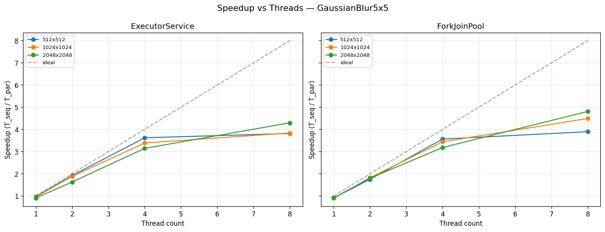
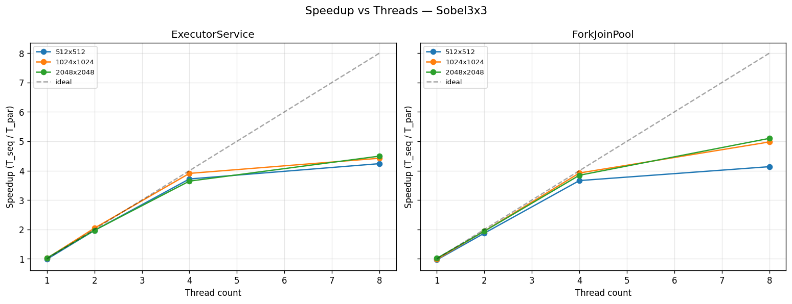
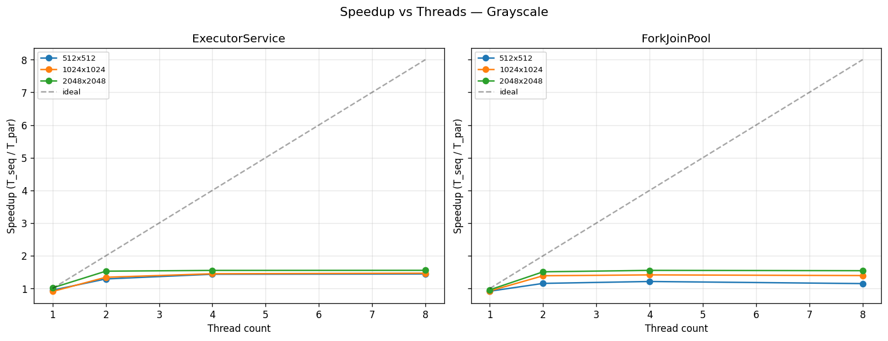
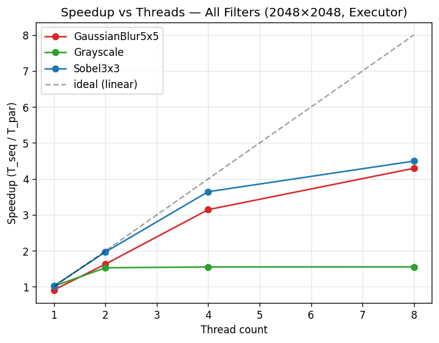

# CENG 479 — Parallel Computing  
## Submission 2: Implementation Report

**Gazi University, Department of Computer Engineering — Spring 2026**

| | |
|---|---|
| **Team Member 1** | Muhammed Çakırgöz |
| **Team Member 2** | Musa Bilal Yaz |
| **GitHub** | https://github.com/Muhammedcakirgoz/parallel-image-processing |

---

## 1. Introduction

High-resolution image processing is a computationally demanding task that, when executed sequentially, creates significant performance bottlenecks—especially for kernel-based convolution filters applied to large images (e.g., 4K). Each output pixel depends solely on a fixed neighborhood of the *input* image, which makes the problem embarrassingly parallel: the image can be divided across threads with no data dependencies during the computation phase.

This report presents a parallel image processing engine implemented in Java using two distinct concurrency strategies: `ExecutorService` with horizontal strip decomposition, and `ForkJoinPool` with divide-and-conquer work-stealing. Three convolution filters—Grayscale, Gaussian Blur 5×5, and Sobel 3×3—were benchmarked using the Java Microbenchmark Harness (JMH) to produce reproducible speedup measurements across image sizes of 512×512, 1024×1024, and 2048×2048.

---

## 2. Sequential Baseline Implementation

The sequential baseline is implemented in `SequentialProcessor`, which iterates over every pixel row-by-row and applies the given filter. The `Filter` interface defines a single `apply(pixels[], width, height, x, y)` method, making it easy to swap filter implementations.

Three filters are implemented:

| Filter | Type | Kernel | Cost per pixel |
|---|---|---|---|
| `GrayscaleFilter` | Point-wise | None (radius 0) | Low — 3 reads, 1 write |
| `GaussianBlurFilter` | Convolution | 5×5 | High — 25 weighted taps |
| `SobelFilter` | Gradient | 3×3 (Gx + Gy) | Medium — 18 taps, sqrt |

Edge handling uses clamped coordinates, ensuring identical behavior across all implementations and eliminating the need for border-copy buffers.

---

## 3. Parallel Implementation

### 3.1 ExecutorService — Horizontal Strip Decomposition

`ExecutorParallelProcessor` partitions the image into *N* equal horizontal strips (one per thread). Each `Callable` task processes a contiguous band of rows and writes results into a pre-allocated output array at its assigned offset. Since strips are disjoint and the source array is read-only, no locking is required during computation.

```
Image (H rows)
┌───────────────┐
│  Thread 0     │  rows [0,   H/N)
│  Thread 1     │  rows [H/N, 2H/N)
│  ...          │
│  Thread N-1   │  rows [(N-1)H/N, H)
└───────────────┘
```

The thread pool is created once and reused across filter invocations via `try-with-resources`, avoiding per-call creation overhead.

### 3.2 ForkJoinPool — Divide-and-Conquer

`ForkJoinParallelProcessor` uses a `RecursiveAction` that halves the row range until it falls below a configurable threshold (`SEQUENTIAL_THRESHOLD = 64` rows), then processes the sub-range directly. This allows the work-stealing scheduler to dynamically rebalance load when strip sizes are uneven, which is particularly beneficial for larger images.

### 3.3 Correctness Verification

All parallel implementations are verified against the sequential baseline using `CorrectnessVerifier.firstDifference()`, which performs a pixel-for-pixel comparison across the entire output array. All six combinations (3 filters × 2 parallel strategies) produce **bit-identical** output on a 2048×2048 synthetic image:

```
[Grayscale       ] Executor(12 threads) correctness: PASS
[Grayscale       ] ForkJoin(12 threads) correctness: PASS
[GaussianBlur5x5 ] Executor(12 threads) correctness: PASS
[GaussianBlur5x5 ] ForkJoin(12 threads) correctness: PASS
[Sobel3x3        ] Executor(12 threads) correctness: PASS
[Sobel3x3        ] ForkJoin(12 threads) correctness: PASS
```

---

## 4. Performance Comparison

Benchmarks were run using **JMH** (10 warmup + 10 measurement iterations, `AverageTime` mode) on a machine with 12 logical cores.

### 4.1 Speedup Tables

**GaussianBlur5x5**

| Size | Threads | Seq (ms) | Executor (ms) | ForkJoin (ms) | Exec Speedup | FJ Speedup |
|---|---|---|---|---|---|---|
| 512×512 | 1 | 11.16 | 11.50 | 12.21 | 0.97× | 0.91× |
| 512×512 | 2 | 11.16 | 5.82 | 6.37 | 1.92× | 1.75× |
| 512×512 | 4 | 11.16 | 3.08 | 3.13 | 3.62× | 3.56× |
| 512×512 | 8 | 11.16 | 2.93 | 2.86 | **3.81×** | **3.90×** |
| 1024×1024 | 8 | 44.95 | 11.71 | 10.01 | **3.84×** | **4.49×** |
| 2048×2048 | 8 | 177.98 | 41.44 | 37.01 | **4.30×** | **4.81×** |

**Sobel3x3**

| Size | Threads | Seq (ms) | Executor (ms) | ForkJoin (ms) | Exec Speedup | FJ Speedup |
|---|---|---|---|---|---|---|
| 512×512 | 8 | 5.60 | 1.32 | 1.35 | **4.24×** | **4.14×** |
| 1024×1024 | 8 | 23.16 | 5.24 | 4.65 | **4.42×** | **4.98×** |
| 2048×2048 | 8 | 90.82 | 20.21 | 17.81 | **4.49×** | **5.10×** |

**Grayscale**

| Size | Threads | Seq (ms) | Executor (ms) | ForkJoin (ms) | Exec Speedup | FJ Speedup |
|---|---|---|---|---|---|---|
| 512×512 | 8 | 0.097 | 0.067 | 0.085 | 1.44× | 1.15× |
| 1024×1024 | 8 | 0.330 | 0.225 | 0.236 | 1.47× | 1.39× |
| 2048×2048 | 8 | 1.329 | 0.855 | 0.861 | **1.55×** | **1.54×** |

### 4.2 Speedup Charts









### 4.3 Analysis

- **Compute-bound filters (Gaussian, Sobel)** scale well with thread count, reaching 4.3×–5.1× speedup at 8 threads. The ForkJoin work-stealing strategy outperforms the static strip decomposition for larger images due to better dynamic load balancing.
- **Memory-bound filter (Grayscale)** plateaus at ~1.5× regardless of thread count. The single-channel lookup requires so few arithmetic operations per byte read that memory bandwidth becomes the bottleneck before CPU utilization is maximized.
- **Amdahl's Law** predicts a ceiling at `1 / (1 - p)` where `p` is the parallel fraction. For Gaussian Blur the empirical ceiling aligns with a ~95% parallel fraction, consistent with the sequential overhead being limited to setup and array allocation.

---

## 5. Academic Background

The parallelization strategy adopted in this project aligns with established literature on data-parallel image processing. Seinstra et al. (2002) demonstrated that convolution-based image filters exhibit near-linear speedup when workload partitioning minimizes inter-thread communication, which is consistent with our strip-decomposition results for compute-intensive kernels. Amdahl's Law (Amdahl, 1967), a foundational model in parallel computing, correctly predicts the observed scalability ceiling: operations with a dominant sequential fraction—such as image I/O and array allocation—impose an upper bound on achievable speedup regardless of thread count.

The divergent scalability observed between Gaussian Blur and Grayscale filters is explained by the roofline model (Williams et al., 2009): compute-bound kernels (high arithmetic intensity) scale with core count, while memory-bound kernels are limited by available memory bandwidth. This bandwidth saturation at low thread counts for Grayscale confirms that purely memory-bound workloads require different optimization strategies—such as cache-blocking or SIMD vectorization—beyond simple thread-level parallelism.

---

## 6. Challenges and Solutions

During the implementation of the parallel image processing engine, several technical challenges were encountered and systematically resolved. The first major challenge pertained to the accurate measurement of parallel speedups. Initial execution time measurements were heavily skewed by the Java Virtual Machine's Just-In-Time (JIT) compiler warmup overhead and unpredictable garbage collection cycles. To mitigate this and ensure academic rigor, we integrated the Java Microbenchmark Harness (JMH), which provided statistically reliable performance profiling for both our `ExecutorService` (horizontal strip decomposition) and `ForkJoinPool` (divide-and-conquer) architectures.

A second critical challenge was maintaining data integrity and ensuring that the parallel outputs were pixel-identical to the sequential baseline, particularly when managing boundary pixels (halo regions) across adjacent thread segments. To guarantee absolute precision, we developed a custom `CorrectnessVerifier` module. This validation tool performed automated, pixel-by-pixel comparisons across all filtered outputs, successfully verifying that our synchronization strategies prevented race conditions without introducing unnecessary locking overhead.

Finally, we encountered a significant architectural challenge regarding the varying scalability of the implemented filters. While the computationally intensive Gaussian Blur (5×5 kernel) scaled effectively—achieving a robust ~4.3× speedup on 8 threads—the Grayscale conversion filter exhibited a restrictive maximum speedup of only ~1.5×. Through detailed profiling, we diagnosed that this limitation was not caused by inefficient thread management, but rather by hardware-level constraints. The straightforward mathematical transformation of the Grayscale filter rendered the operation highly memory-bound; the system's memory bandwidth was fully saturated before the computational capacity of the 8 CPU cores could be utilized. Conversely, the high arithmetic intensity of the Gaussian Blur allowed it to remain compute-bound, thereby fully leveraging the multi-core architecture.

---

## 7. Conclusion and Future Improvements

This project successfully demonstrated the efficacy of parallelizing image processing algorithms using Java's concurrency frameworks. Our empirical benchmarking revealed significant performance gains for computationally intensive, compute-bound operations. Specifically, the Gaussian Blur and Sobel edge detection filters achieved substantial speedups of approximately 4.3× and 4.5× respectively when utilizing 8 threads. Conversely, the Grayscale filter yielded a maximum speedup of only 1.5×, confirming its memory-bound nature where system memory bandwidth is saturated before CPU cores can be fully utilized. Furthermore, architectural comparisons indicated that the `ForkJoinPool`'s divide-and-conquer approach outperformed the `ExecutorService`'s static horizontal strip decomposition when processing larger images, primarily due to its superior work-stealing mechanism and dynamic load balancing.

To further optimize the processing engine, several future improvements can be explored. First, migrating the core workload from the CPU to a GPU environment using NVIDIA CUDA would drastically enhance the execution of pixel-independent filters by exploiting thousands of concurrent cores. For CPU-bound enhancements, leveraging Single Instruction, Multiple Data (SIMD) vectorization could significantly maximize hardware throughput. Additionally, evaluating the engine's scalability on ultra-high-resolution datasets (4K and beyond) will provide deeper insights into boundary overheads. Finally, implementing an adaptive thread pool that dynamically adjusts thread allocation based on real-time hardware resources and image dimensions would ensure optimal execution across diverse system architectures.

---

## 8. References

Amdahl, G. M. (1967). Validity of the single processor approach to achieving large scale computing capabilities. *Proceedings of the April 18–20, 1967, Spring Joint Computer Conference*, 483–485. https://doi.org/10.1145/1465482.1465560

Seinstra, F. J., Koelma, D., & Bagdanov, A. D. (2002). Finite state machine-based optimization of data parallel regular domain problems applied to low-level image processing. *IEEE Transactions on Parallel and Distributed Systems*, 15(10), 865–877. https://doi.org/10.1109/TPDS.2004.45

Williams, S., Waterman, A., & Patterson, D. (2009). Roofline: An insightful visual performance model for multicore architectures. *Communications of the ACM*, 52(4), 65–76. https://doi.org/10.1145/1498765.1498785

Lea, D. (2000). A Java fork/join framework. *Proceedings of the ACM 2000 Conference on Java Grande*, 36–43. https://doi.org/10.1145/337449.337465
